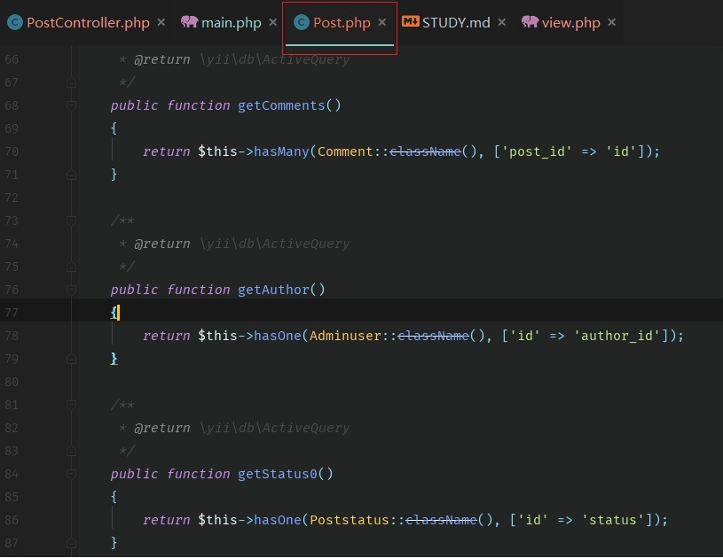

<h1>Yii2 学习笔记 - HH</h1>

Advanced高级应用模板：[官方安装文档](https://github.com/yiisoft/yii2-app-advanced/blob/master/docs/guide/start-installation.md)

安装步骤：

- **Composer 安装** : 打开控制台，切换至Web根目录www。执行` composer create-project --prefer-dist yiisoft/yii2-app-advanced yii-application` ，yii-application可修改为自己的项目名称。

    1、打开控制台，切换至项目根目录yii-application，执行命令 php init ，选择dev开发模式。

    2、新建一个空数据库，依次打开项目文件/common/config/main-local.php,修改db数据库连接配置。
    
    3、打开控制台，切换至项目根目录yii-application，执行命令 php yii migrate 新增Advanced初始user
    表，另一个数据迁移表暂时不管。
    
> 至此，Advanced高级应用模板安装完毕。

Advanced目录结构：
```
frontend与backend
前后台入口，都有着各自的【MVC目录(models|views|controllers)、配置文件目录(config)、入口文件目录(web)、资源文件目录(assets)】。

console
控制台入口，用来控制执行的程序，比如放一些定时执行的程序，或者需要在更底层的操作系统上运行的功能。

common
共用的目录，比如前后台共用的模型文件就可以放在这里。

environments
放环境的配置文件。
```

\_\_DIR\_\_ 返回当前文件的目录:
```
    eg: D:\wamp\WWW\phpinfo.php
        echo __DIR__;
        D:\wamp\WWW
```

dirname() 返回当前文件路径的上一级:
```
    eg: D:\wamp\WWW\phpinfo.php
        1、
            echo dirname('D:\wamp\WWW\phpinfo.php');
            D:\wamp\WWW
        2、
            echo dirname(__DIR__);
            D:\wamp
```

什么是Gii?
```
Gii是一个基于Web的代码生成器。可以用来生成模型，控制器，表单，增删改查等等这些类或功能的代码。（Gii也叫作脚手架程序）
```

hasOne、hasMany方法的使用原则：
```
1、hasOne 用于多对一，一对一的情况；eg：多篇文章使用同一种状态

2、hasMany 一对多的情况。eg：一篇文章有多个评论
```

hasOne、hasMany查询关联数据：



另附上ASCII字符与URL编码的对照表：
```
ASCII字符   URL编码
空格     %20
!     %21
"    %22
#   %23
$    %24
%   %25
&    %26
'     %27
(    %28
)    %29
*    %2A
+   %2B
,     %2C
-     %2D
.     %2E
/    %2F
0    %30
1    %31
2    %32
3    %33
4    %34
5    %35
6    %36
7    %37
8    %38
9    %39
:     %3A
;     %3B
<   %3C =   %3D >   %3E
?    %3F
@   %40
A    %41
B    %42
C    %43
D    %44
E    %45
F    %46
G    %47
H    %48
I    %49
J    %4A
K    %4B
L    %4C
M   %4D
N    %4E
O   %4F
P    %50
Q   %51
R    %52
S    %53
T    %54
U    %55
V    %56
W   %57
X    %58
Y    %59
Z    %5A
[    %5B
\    %5C
]    %5D
^   %5E
_    %5F
`    %60
a    %61
b    %62
c    %63
d    %64
e    %65
f     %66
g    %67
h    %68
i     %69
j     %6A
k    %6B
l     %6C
m   %6D
n    %6E
o    %6F
p    %70
q    %71
r     %72
s    %73
t     %74
u    %75
v    %76
w   %77
x    %78
y    %79
z    %7A
{    %7B
|    %7C
}    %7D
~   %7E
%7F
€    %80
%81
‚    %82
ƒ    %83
„    %84
…   %85
†    %86
‡    %87
ˆ    %88
‰  %89
Š    %8A
‹     %8B
Π  %8C
%8D
Ž    %8E
%8F
%90
‘   %91
’   %92
“   %93
”   %94
•    %95
–    %96
—  %97
˜    %98
™   %99
š    %9A
›     %9B
œ   %9C
%9D
ž    %9E
Ÿ    %9F
%A0
¡     %A1
¢    %A2
£    %A3
%A4
¥    %A5
|    %A6
§    %A7
¨    %A8
©   %A9
ª    %AA
«    %AB
¬   %AC
¯    %AD
®   %AE
¯    %AF
°    %B0
±   %B1
²    %B2
³    %B3
´     %B4
µ    %B5
¶    %B6
·     %B7
¸     %B8
¹    %B9
º    %BA
»    %BB
¼   %BC
½   %BD
¾   %BE
¿    %BF
À    %C0
Á    %C1
    %C2
à   %C3
Ä    %C4
Å    %C5
Æ   %C6
Ç    %C7
È    %C8
É    %C9
Ê    %CA
Ë    %CB
Ì    %CC
Í    %CD
Î    %CE
Ï    %CF
Ð   %D0
Ñ    %D1
Ò   %D2
Ó   %D3
Ô   %D4
Õ   %D5
Ö   %D6
%D7
Ø   %D8
Ù    %D9
Ú    %DA
Û    %DB
Ü    %DC
Ý    %DD
Þ    %DE
ß    %DF
à    %E0
á    %E1
â    %E2
ã    %E3
ä    %E4
å    %E5
æ   %E6
ç    %E7
è    %E8
é    %E9
ê    %EA
ë    %EB
ì     %EC
í     %ED
î     %EE
ï     %EF
ð    %F0
ñ    %F1
ò    %F2
ó    %F3
ô    %F4
õ    %F5
ö    %F6
÷   %F7
ø    %F8
ù    %F9
ú    %FA
û    %FB
ü    %FC
ý    %FD
þ    %FE
ÿ    %FF
```